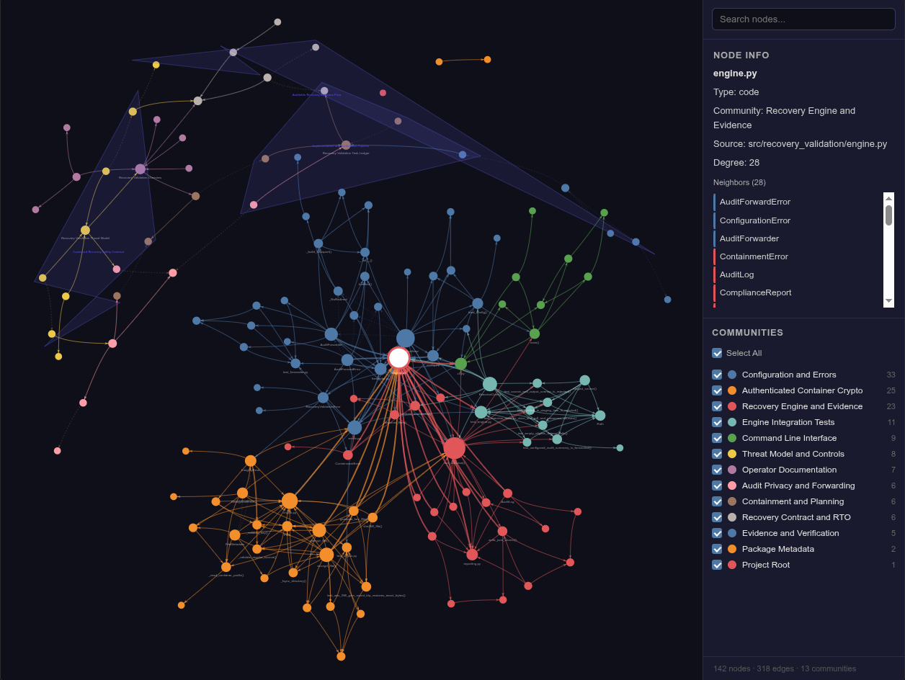

# Recovery Validation

A contained recovery exercise for authorized `.docx` and `.pdf` staging datasets. It creates isolated AES-256-GCM ciphertext copies, decrypts them into a restoration tree, verifies SHA-256 equality, measures RTO/RPO, and emits compliance evidence without changing source files.



## Safety Contract
- Requires `.recovery-validation-staging` in the source root.
- Rejects source/output overlap and every symbolic link in the staging tree.
- Never encrypts, renames, deletes, or overwrites source data.
- Uses one random 256-bit key per exercise and a unique 96-bit nonce per file.
- Keeps forwarding disabled unless an HTTPS endpoint and token environment variable are configured.
- Stages systemd files without installing or enabling them.

## Install and Test
```bash
python3.11 -m venv .venv
.venv/bin/python -m pip install -e '.[dev]'
.venv/bin/python -m pytest
.venv/bin/python -m ruff check .
.venv/bin/python -m mypy src
```

## Run
```bash
cp config.example.toml config.toml
mkdir -p /tmp/recovery-staging
touch /tmp/recovery-staging/.recovery-validation-staging
# Point config.toml at the staging and output directories.
.venv/bin/recovery-validation run --config config.toml
```

Each run writes a UUID-named directory containing encrypted copies, restored copies, a mode-`0600` key, `audit.jsonl`, `validation-summary.json`, and `compliance-report.json`.

## Design Sources
- `cryptography` 50 AES-GCM documents 128/192/256-bit keys, authenticated associated data, 96-bit nonce guidance, nonce non-reuse, and `InvalidTag` failure behavior: https://cryptography.io/en/50.0.0/hazmat/primitives/aead/#cryptography.hazmat.primitives.ciphers.aead.AESGCM
- Python 3.11 `tomllib` reads TOML from binary file objects: https://docs.python.org/3.11/library/tomllib.html
- systemd unit settings and sandboxing are defined by the upstream systemd manual sources: https://github.com/systemd/systemd/tree/main/man

See `docs/how-it-works.md` for the complete execution flow. The formal contract, threat model, and operator procedure remain in `docs/spec.md`, `docs/threat-model.md`, and `docs/runbook.md`.
