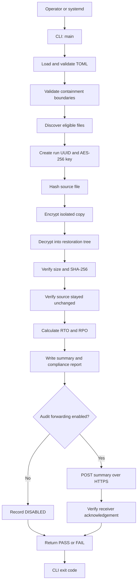

# How Recovery Validation Works

This document traces one recovery-validation run from the operator command to the final compliance evidence. The system operates only on authorized staging copies of `.docx` and `.pdf` files. It never encrypts, renames, deletes, or overwrites the source dataset.

## System Flow



The central coordinator is `run_exercise()` in `src/recovery_validation/engine.py`. Every other runtime module either prepares its inputs, performs one controlled operation, or records its result.

## Component Map

| Component | Responsibility |
|---|---|
| `cli.py` | Parses `run --config`, emits one JSON result, and selects the exit code. |
| `config.py` | Parses TOML, rejects unknown keys, validates numeric limits, and pairs audit endpoint settings. |
| `engine.py` | Enforces containment, discovers files, coordinates encryption and restoration, calculates RTO/RPO, and builds reports. |
| `crypto.py` | Creates keys, writes authenticated containers, decrypts them, and verifies authenticated metadata. |
| `reporting.py` | Defines report records and performs durable JSON/JSONL writes. |
| `forwarder.py` | Sends the summary to an approved HTTPS endpoint and verifies its acknowledgement. |
| `errors.py` | Defines the expected recovery, configuration, containment, integrity, decryption, and forwarding failures. |
| `systemd/` | Provides the dedicated account, directories, and hardened boot-time service definition. |

The generated architecture graph confirms that `run_exercise()` is the highest-connectivity function and that the project has no import cycles. See `graphify-out/GRAPH_REPORT.md` and `graphify-out/graph.html`.

## 1. Startup and Configuration

The operator starts the package with:

```bash
recovery-validation run --config /etc/recovery-validation/config.toml
```

`cli.main()` calls `load_config()`. The configuration loader requires a regular, non-symbolic-link TOML file and accepts only these keys:

| Key | Required | Default | Meaning |
|---|---:|---:|---|
| `source_dir` | Yes | None | Authorized staging root. |
| `output_dir` | Yes | None | Parent directory for UUID-named exercise runs. |
| `rto_seconds` | No | `14400` | Maximum allowed recovery duration. |
| `max_file_bytes` | No | `2147483648` | Maximum size of one eligible file. |
| `audit_endpoint` | No | Disabled | Approved absolute HTTPS receiver URL. |
| `audit_token_env` | With endpoint | Disabled | Environment-variable name containing the bearer token. |
| `ca_bundle` | No | Platform trust store | Optional CA bundle for TLS verification. |
| `request_timeout_seconds` | No | `10` | Audit request timeout; must be greater than zero and no more than 60. |

Unknown keys fail closed. `audit_endpoint` and `audit_token_env` must be supplied together. The bearer token is loaded from the environment before filesystem processing begins and is never written to a report or log.

## 2. Containment Checks

Before creating a run, the engine resolves the source and output paths and enforces four boundaries:

1. `source_dir` must already exist and be a directory.
2. `source_dir` must contain a regular `.recovery-validation-staging` marker.
3. Source and output paths must not be equal, parents of each other, or children of each other.
4. Every symbolic link found while walking the staging tree causes the run to stop.

These checks keep the recovery exercise away from live data and prevent the output tree from feeding back into discovery.

## 3. File Discovery

The engine walks the source tree without following links. It selects only regular files whose case-insensitive suffix is `.docx` or `.pdf`.

- Unsupported files are ignored.
- The staging marker is ignored.
- An eligible file larger than `max_file_bytes` stops the run.
- An empty eligible dataset stops the run.
- Results are sorted by relative path so processing order is deterministic.

Absolute paths and source filenames are not placed in audit records. Each file receives this identifier:

```text
file_id = HMAC-SHA256(exercise_key, relative_path)
```

The HMAC gives the report a stable identifier within the exercise without exposing a patient-identifying filename.

## 4. Exercise Workspace and Key

Every run receives a UUID correlation ID. Its workspace is:

```text
<output_dir>/
└── <correlation_id>/
    ├── audit.jsonl
    ├── compliance-report.json
    ├── validation-summary.json
    ├── encrypted/
    │   └── <source-relative-path>.rvg
    ├── restored/
    │   └── <source-relative-path>
    └── keys/
        └── exercise.key
```

`generate_key_file()` creates one random 256-bit AES key for the exercise by calling `AESGCM.generate_key(bit_length=256)`. The key file is created exclusively with mode `0600`, flushed with `fsync()`, and never included in JSON evidence.

Each file receives a separate random 96-bit nonce. The key is shared only within that one exercise; nonces are never intentionally reused.

## 5. Encrypted Container Format

Each `.rvg` file has this binary layout:

```text
+----------------------+----------------------------------------------+
| Field                | Contents                                     |
+----------------------+----------------------------------------------+
| Magic                | 8 bytes: RVGCM001                            |
| Header length        | 4-byte unsigned big-endian integer           |
| Header               | Canonical UTF-8 JSON                         |
| Ciphertext           | AES-256-GCM encrypted source bytes           |
| Authentication tag   | 16-byte GCM tag                              |
+----------------------+----------------------------------------------+
```

The JSON header contains:

```json
{
  "algorithm": "AES-256-GCM",
  "correlation_id": "exercise UUID",
  "file_id": "HMAC-SHA256 identifier",
  "nonce": "base64-encoded 96-bit nonce",
  "sha256": "original plaintext SHA-256",
  "size_bytes": 12345,
  "version": 1
}
```

The exact header bytes are supplied to GCM as associated authenticated data. The header is readable, but any change to its version, algorithm, correlation ID, file identifier, nonce, digest, or size invalidates the authentication tag.

Encryption is streamed in 65,536-byte buffers. The output is written to a mode-`0600` temporary file, flushed, atomically moved into place, and followed by a directory `fsync()`. A partial container never replaces a completed one.

## 6. Decryption and Restoration

The decryptor validates the container before producing a restored file:

1. Verify the `RVGCM001` magic value.
2. Read and bound the JSON header to 65,536 bytes.
3. Require the exact version-1 header field set.
4. Decode and require a 12-byte nonce.
5. Read the final 16 bytes as the GCM tag.
6. Authenticate the original header bytes as associated data.
7. Stream decrypted bytes into a temporary restoration file.
8. Compare restored byte count and SHA-256 with the authenticated header.
9. Atomically move the verified temporary file into the restoration tree.

If the key, nonce, header, ciphertext, or authentication tag is wrong, `cryptography` raises `InvalidTag`. The package converts it to `DecryptionError`, deletes the temporary plaintext, and records the file as failed.

## 7. Independent Integrity Checks

Authenticated decryption is necessary but not the final verdict. The engine performs independent comparisons after restoration:

```text
restored SHA-256 == pre-exercise source SHA-256 == authenticated header SHA-256
restored size    == pre-exercise source size    == authenticated header size
post-exercise source SHA-256 == pre-exercise source SHA-256
```

A file passes only when the restored copy matches and the staging source remained unchanged. Failure of either check produces `status: FAIL` for that file.

## 8. RTO and RPO

RTO timing starts immediately before the `recovery_exercise_started` event and ends after all file encryption, decryption, and integrity verification completes.

```text
RTO PASS = measured_seconds <= rto_seconds
```

Optional HTTPS audit forwarding occurs after this measurement and is not included in the recovery RTO.

RPO is calculated from the original sizes of files that did not pass:

```text
bytes_lost = sum(size_bytes for every failed file)
RPO PASS   = bytes_lost == 0
```

The overall recovery result passes only when every file passes, RTO passes, RPO passes, and any configured audit delivery succeeds.

## 9. Audit Evidence

`AuditLog.record()` appends one compact JSON object per line to `audit.jsonl`. Every event contains the same correlation ID.

Typical event sequence:

```text
recovery_exercise_started
recovery_file_verified | recovery_file_failed
audit_summary_forwarded | audit_summary_forward_failed
recovery_exercise_completed
```

The log contains file IDs, sizes, durations, statuses, and error class names. It does not contain source paths, plaintext, keys, bearer tokens, or full audit URLs.

`validation-summary.json` contains the compact operational verdict. `compliance-report.json` adds:

- Per-file original and restored SHA-256 values.
- Encryption and decryption durations.
- Decryption and source-immutability results.
- Aggregate bytes verified.
- RTO and RPO measurements.
- Audit-forwarding status.
- Diaz, Hart, and Reyes role assignments.
- Pending recovery-lead and compliance signoff fields.

Both JSON files use temporary-file, `fsync()`, atomic-replace, and mode-`0640` writes.

## 10. Optional Central Audit Forwarding

Forwarding is disabled unless both audit settings are configured. When enabled, `AuditForwarder`:

1. Requires an absolute `https://` URL with a host.
2. Rejects URLs containing embedded credentials or fragments.
3. Builds a verified TLS context, optionally using `ca_bundle`.
4. Refuses HTTP redirects.
5. Sends `validation-summary.json` with `Content-Type: application/json`.
6. Supplies the token as `Authorization: Bearer ...` and the UUID as `X-Correlation-ID`.
7. Accepts only HTTP `2xx` responses.
8. Limits the response body to 65,536 bytes.
9. Requires JSON containing `accepted: true` and the matching `correlation_id`.

An invalid acknowledgement is treated as failed delivery. The endpoint host and HTTP status may be logged; credentials and full URLs are not.

## 11. CLI Results and Exit Codes

The CLI always prints machine-readable JSON.

| Exit | Meaning |
|---:|---|
| `0` | Every file, RTO, RPO, and configured forwarding gate passed. |
| `1` | The exercise completed and wrote evidence, but at least one validation gate failed. |
| `2` | Configuration, containment, cryptographic setup, or another expected recovery error prevented a complete exercise. |

Per-file exceptions are converted into failed `FileResult` entries so the engine can finish the remaining dataset and produce a complete report. Preflight failures occur before the exercise and return exit code `2`.

## 12. systemd Boot Execution

`systemd/recovery-validation.service` is a `Type=oneshot` unit enabled under `multi-user.target`. At boot it requires both the configuration file and staging marker before starting.

The service runs as the dedicated `recovery-validation` account with:

- Read-only access to `/srv/recovery-validation/staging`.
- Write access only to `/var/lib/recovery-validation/exercises`.
- An empty capability bounding set.
- `NoNewPrivileges=yes`.
- Protected kernel, device, home, clock, hostname, and control-group surfaces.
- Restricted namespaces, real-time access, address families, and system calls.

The unit, sysusers definition, and tmpfiles definition are shipped but are not installed or enabled automatically. Installation requires Diaz's approval because it changes host state.

## 13. Failure Behavior

| Failure | Result |
|---|---|
| Missing staging marker | Run stops before workspace creation. |
| Source/output overlap | Run stops before workspace creation. |
| Symbolic link in staging | Run stops before encryption. |
| No eligible files | Run stops before key generation. |
| Oversized eligible file | Run stops before key generation. |
| Wrong or altered key | GCM authentication fails; temporary plaintext is deleted. |
| Altered header, ciphertext, nonce, or tag | GCM authentication fails; temporary plaintext is deleted. |
| Restored hash or size mismatch | File receives `FAIL`; unverified output is not promoted. |
| Source changes during exercise | File receives `FAIL`. |
| RTO exceeds threshold | Overall result receives `FAIL`. |
| Audit receiver rejects or fails acknowledgement | Overall result receives `FAIL`. |

Failed run directories are preserved for investigation. Operators start a fresh run with a new UUID and key instead of overwriting evidence.

## 14. Verification Suite

The tests cover:

- AES-256-GCM round-trip restoration.
- Ciphertext tampering and wrong-key rejection.
- Key length and mode enforcement.
- `.docx` and `.pdf` discovery.
- Source immutability.
- Staging marker, overlap, symlink, and empty-dataset rejection.
- CLI success and configuration-error exit behavior.
- HTTPS-only forwarding, authenticated request fields, JSON validation, and acknowledgement verification.

Run all gates with:

```bash
.venv/bin/python -m pytest --cov=recovery_validation --cov-report=term-missing
.venv/bin/python -m ruff check .
.venv/bin/python -m mypy src
.venv/bin/python -m pip_audit
systemd-analyze verify systemd/recovery-validation.service
```

## 15. Operational Boundary

The current implementation stores the exercise key on the same host as its encrypted and restored artifacts. That is appropriate for this contained validation harness. Production key custody should replace the local key file with approved key escrow or KMS-backed envelope encryption.

The system proves that the staged files can be encrypted, decrypted, restored byte-for-byte, measured against RTO/RPO, and represented in auditor-readable evidence. It does not alter live data, install services, approve signoff, or choose the production audit endpoint.
